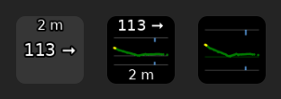

## Nightscout Viewer

This is simple little project to show the current [Nightscout](http://www.nightscout.info/) value and its trend
on a button for [StreamController](https://github.com/StreamController/StreamController).

!!It is still being developed so expect the Plugin to sometimes crash your setup!!

Unfortunately I need to use the main Branch for development, in order for my current
testing setup (StreamController Store) to work. So expect even more Buggyness and maybe
don't update the plugin immediately. Thanks!

### Features

Version: 0.1.0

+ Connect with Nightscout API and show the connection status
+ Display the most recent value and its trend on a key
+ Show how outdated the most recent value is
+ Update the value every 60 seconds or manually by pressing the key

Version 0.2.0

+ Add Graph View
+ Add Combined View
+ Add Nightscout instance per action
+ Add colorized plot on image views

Version 0.3.0

+ Add Treatment (carbs at the bottom, insulin on top) indicators
+ Establish framework for other Nightscout data

### Known Problems

Having multiple view actions (Graph, Combined) on one page with both of them set to the same Nightscout instance can have one of them not load in correctly and take 30 seconds until the image appears. This is probably due to both view widgets querying the same Nightscout API for values and the API only responding to one.

### Installation

1. Copy the URL of this repo
2. Open StreamController
3. Go to Settings > Store
4. Enable Custom Plugins
5. Click on the "+" and paste the Repo URL
6. Go to the shop and download the plugin
7. Enjoy

### Setup

1. Get the URL of your Nightscout instance
2. Optionally generate a token with the "readable" Role if you configured Nightscout to need authentication
3. Add One of the Nightscout actions to a key in StreamController
4. Click on the action to get to the settings
5. Input the URL and optionally the token
6. It should say Connected beneath the inputs if the instance could be reached
7. In a moment the data should appear 

### TODO

+ Expose more Settings
+ Take other Data from Nightscout into Account(Profiles, Food, Insulin, Predictions)
+ Add visual Alerts (Red font, flashing)
+ Add hour indicators on graph
